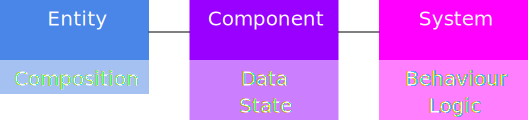
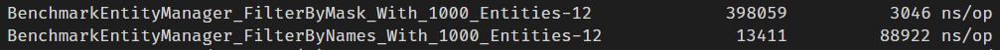

# ECS - Entity Component System

**Build your own Game-Engine based on the Entity Component System concept in Golang**

The architectural pattern of an ECS is mostly used in game development,
to provide long-term maintainability and extendability of large, dynamic systems.

An **Entity** is basically a composition of different components and has an ID.  
A **Component** contains only the state or data of one specific aspect like health, position, velocity etc.  
A **System** handles the behaviour or logic of the components. A movement system uses the position and velocity to implement an entities movement. 

**Table of Contents**

- [Goals](README.md#goals)
- [Installation](README.md#installation)
- [Steps to start](README.md#steps-to-start)

## Goals

- Provide an **easy-to-use** framework to build a game engine from scratch.
- **No dependencies** to other modules or specific game libraries - Feel free to use what fits your needs.
- **Minimum overhead** - use only what is really needed.
- **Plugins** to offer unlimited room for improvements.

## Installation

**From Source**

    go get -u github.com/andygeiss/ecs

## Steps to start

The first step is to be clear about what we want our game engine to do. The main task is to make sure that we have combined all the essential components that are responsible for the technical and logical aspects.

An Entity Component System (ECS) helps us to do this because the logical components (data) such as entities and their components can be separated from the actual logic. Among other things, this has the advantage that we can implement and test the game mechanics independently from the rest.

So let's start...

We decide to use 2D and define the **three most important components**:
* [Position](https://github.com/andygeiss/ecs-example/blob/main/internal/components/position.go)
* [Size](https://github.com/andygeiss/ecs-example/blob/main/internal/components/size.go)
* [Velocity](https://github.com/andygeiss/ecs-example/blob/main/internal/components/velocity.go)

In the next step, the **three most important systems** implement:
* [Collision](https://github.com/andygeiss/ecs-example/blob/main/internal/systems/collision.go)
* [Movement](https://github.com/andygeiss/ecs-example/blob/main/internal/systems/movement.go)
* [Rendering](https://github.com/andygeiss/ecs-example/blob/main/internal/systems/rendering.go)

## I want more than 64 Components !

Yes! You can do that by adding a `Name()` function to your component and using `FilterByNames` instead of `FilterByMask`.
However if you want the fastest possible solution you need to know that `FilterByNames` is `40` times slower than `FilterByMask`.
This will maybe not impact your Game if there are only a few thousands of entities. ;-)

